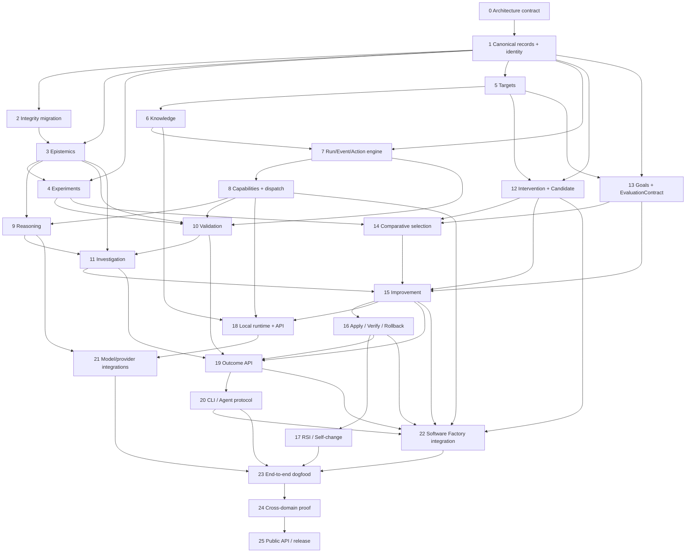

# libRSI Parallel Implementation Plan & Dependency Graph

**Companion to:** *libRSI Architecture Expansion & Implementation Tracker*  
**Baseline:** `main` at `d96cc666c7800681dfdde2f991f841b09155dfe8`  
**Objective:** Maximize safe parallel implementation while minimizing architectural rework, merge conflicts, and duplicated abstractions.

---

# 1. Executive conclusion

The 26 implementation Blocks should **not** be executed as one linear sequence.

The program has a short unavoidable architectural spine:

```text
Block 0
Architecture contract
    ↓
Block 1
Canonical records / identity contract
```

After that, the work can fan out into several largely independent streams:

```text
                         ┌─ Epistemics
                         │
                         ├─ Experiments
                         │
Canonical contracts ─────┼─ Targets + knowledge
                         │
                         ├─ Runtime + capabilities
                         │
                         └─ Intervention / goal semantics
```

These streams reconverge around:

```text
Validation
    ↓
Investigation
    ↓
Improvement
    ↓
Application / verification
    ↓
RSI / self-improvement
```

Product interfaces, external-agent support, reasoner integrations, Software Factory integration, and cross-domain dogfood can then proceed in additional parallel streams around the stabilized engine.

The main rule is:

> **Freeze semantic interfaces early; parallelize implementations behind those interfaces.**

Do not parallelize several incompatible versions of the basic ontology.

---

# 2. Hard dependencies versus architectural dependencies

The primary tracker intentionally used conservative dependencies.

For parallel execution, distinguish:

### Hard dependency

Code cannot sensibly be implemented until the predecessor exists.

Example:

```text
Improvement selection
requires
candidate evaluations
```

### Contract dependency

Implementation can proceed once the predecessor's **interface is frozen**, even if its full implementation is unfinished.

Example:

```text
SQLite KnowledgeStore implementation
does not require the entire knowledge subsystem to be finished.

It requires a stable KnowledgeStore contract.
```

### Integration dependency

Two components can be built independently but cannot be declared complete until integrated.

Example:

```text
Experiment subsystem
+
epistemic subsystem

can be built in parallel,

but experiment → Evidence integration
requires both.
```

This distinction creates most of the available parallelism.

---

# 3. Optimized top-level dependency graph



This is still conservative. Several Blocks can be decomposed further to expose more parallelism.

---

# 4. The critical path

The conceptual engine critical path is approximately:

```text
0 Architecture
 ↓
1 Canonical contracts
 ↓
3 Epistemics
 ↓
4 Experiments
 ↓
7/8 Runtime + capabilities
 ↓
10 Validation
 ↓
11 Investigation
 ↓
12/13/14 Intervention + goals + selection
 ↓
15 Improvement
 ↓
16 Application / verification
 ↓
17 RSI
```

However:

```text
2 Integrity migration
5 Targets
6 Knowledge
12 Interventions
13 Goals
```

should be developed alongside that path rather than waiting for it.

The final release path adds:

```text
18–22 product/integration surfaces
 ↓
23 system dogfood
 ↓
24 cross-domain proof
 ↓
25 release
```

---

# 5. Recommended workstreams

## Stream A — Semantic spine / architecture authority

**Blocks:** 0 → 1, then cross-stream contract maintenance

**Owns:**

- canonical terminology;
- base IDs/references;
- canonical record semantics;
- serialization rules;
- identity rules;
- schema/version conventions;
- common errors;
- package-wide API contracts.

This should be the **lowest-concurrency workstream**.

Do not allow several agents to independently redefine:

```text
Claim
Evidence
TargetSnapshot
ExperimentSpec
Intervention
Action
Outcome
```

This stream establishes those contracts for everyone else.

### Primary outputs

```text
Architecture contract
Canonical records
Identity rules
Serialization rules
Stable refs
Compatibility strategy
```

### Merge authority

This stream should also own contentious central files during the early migration:

```text
src/librsi/__init__.py
src/librsi/models.py
src/librsi/identity.py
pyproject.toml
```

Other streams should preferentially add modules rather than repeatedly modifying these files.

---

# 6. Stream B — Epistemics

**Blocks:** 2 → 3

Can start immediately after Block 1 contracts freeze.

**Owns:**

```text
Claim
Hypothesis
Evidence
EvidenceAggregator
belief/confidence policies
provenance relationships
claim status
hypothesis lineage
```

### Subtasks that can run independently

#### B1 — Current API integrity migration

Repair:

```text
HypothesisProposal
HypothesisUpdate
```

and compatibility wrappers.

#### B2 — Generic Claim model

Implement claim kinds, claim status, evidence binding.

#### B3 — Evidence aggregation

Move current linear confidence behavior behind:

```python
EvidenceAggregator
```

#### B4 — Provenance and lineage

Evidence/claim/hypothesis lineage relationships.

These can be done on separate branches if Block 1 defines their base records.

---

# 7. Stream C — Experimentation and quantitative evaluation

**Block:** 4

Can proceed largely in parallel with Stream B once canonical references are frozen.

**Owns:**

```text
ExperimentSpec
Trial
Observation
Measurement
Metric
DecisionRule
ExperimentEvaluation
```

### Internal parallelization

#### C1 — Experiment specification

Generic experiment schema and identity.

#### C2 — Measurement / metric system

```text
minimize
maximize
target
guardrail
minimum effect
```

#### C3 — Trial/evaluation machinery

Valid / invalid / inconclusive execution.

#### C4 — Existing command adapter

Reimplement current command behavior as:

```text
CommandExperiment
```

rather than the universal experiment type.

#### C5 — Comparative experiment support

Baseline versus candidate.

### Integration point with Stream B

At completion:

```text
ExperimentEvaluation
    ↓
Evidence
```

must use Stream B's canonical evidence contract.

The two streams do **not** otherwise need to block one another.

---

# 8. Stream D — Targets and knowledge

**Blocks:** 5 → 6

Can run in parallel with B and C after Block 1.

**Owns:**

```text
Target
TargetRef
TargetSnapshot
TargetComponent
TargetCapabilities
KnowledgeStore
knowledge retrieval
target currentness
```

### Parallel decomposition

#### D1 — Generic target model

No Git assumptions.

#### D2 — Multi-component target snapshots

Needed eventually for multi-repo systems.

#### D3 — KnowledgeStore protocol

Can begin as soon as Block 1 records exist.

#### D4 — SQLite persistence

Can proceed independently once the protocol is frozen.

#### D5 — Knowledge retrieval/currentness

Queries across claims, evidence, experiments, outcomes and snapshots.

### Key architectural boundary

Do not merge:

```text
Target
```

with:

```text
Knowledge
```

Target = current subject.

Knowledge = accumulated beliefs/evidence concerning targets.

---

# 9. Stream E — Runtime and control plane

**Blocks:** 7 → 8

This stream has one useful decomposition that substantially increases parallelism.

## E1 — Pure runtime state machine

Can begin after Block 1.

Implement:

```text
Run
RunState
Event
Action
ActionResult
Transition
```

with an **in-memory state repository** initially.

This means it does not need to wait for the complete SQLite knowledge implementation.

## E2 — Durable runtime persistence

Integrate with Stream D once `KnowledgeStore` / runtime-store contracts stabilize.

## E3 — Capability protocols

Can begin in parallel with E1 after the `Action` contract exists:

```text
Inspector
Retriever
Reasoner
Experimenter
Implementer
Reviewer
Applier
Verifier
```

## E4 — Capability dispatch

After E1 + E3.

## E5 — Replay / resume / idempotence

After E1 + persistence.

### Result

This allows Blocks 7 and 8 to start much earlier than a strict reading of the original dependency chain suggests.

---

# 10. Stream F — Reasoning

**Block:** 9

Can start when:

```text
Claim/Hypothesis contracts
+
Action protocol
+
Capability protocol
```

are frozen.

It does **not** need SQLite, improvement, application, CLI, or Software Factory.

Parallel work:

```text
reflection request/result
hypothesis-generation request/result
experiment-design request/result
problem-decomposition request/result
intervention-generation request/result
```

Then one shared validation layer ensures reasoning outputs cannot become authoritative merely because an LLM produced them.

---

# 11. First major convergence: Validation

**Block 10**

This is the first major integration milestone.

It joins:

```text
Epistemics
+
Experiments
+
Targets
+
Knowledge
+
Runtime
+
Capabilities
```

into one useful product.

The important reason to target this milestone early is that it proves libRSI's generalized architecture without requiring candidate changes or RSI.

### Milestone API

```python
lib.validate(
    target=target,
    claim=claim,
)
```

### Parallelism during Block 10

Split:

#### V1 — Validation planner

Determine existing evidence and evidence gaps.

#### V2 — Execution workflow

Translate evidence gaps to Actions.

#### V3 — Evidence aggregation

Convert results into claim state.

#### V4 — ValidationResult

Produce standardized output.

These can be developed independently against frozen interfaces.

---

# 12. Stream G — Investigation

**Block:** 11

Starts after Validation is basically functional.

Parallel work:

```text
hypothesis generation
hypothesis ranking
branch lineage
experiment selection
information-gain heuristics
branch retirement
alternative generation
answer synthesis
```

This stream should reuse the existing portfolio concepts rather than duplicating lane/state machinery.

---

# 13. Stream H — Intervention semantics

**Block:** 12

This stream can actually start **well before Investigation is complete**.

Once Blocks 1 and 5 are stable, implement:

```text
Intervention
InterventionSpec
Candidate
CandidateSnapshot
ImplementationResult
```

This can proceed in parallel with Blocks 9–11.

### Important boundary

```text
Intervention
    ↓
Implementer
    ↓
Candidate
```

does **not** mean:

```text
authoritative target changed
```

That distinction should be established before the improvement engine exists.

---

# 14. Stream I — Goal and evaluation-contract semantics

**Block:** 13

This also does not need to wait for Investigation.

Can run beside Stream H.

Implement:

```text
Goal
Objective
Constraint
Guardrail
EvaluationContract
Baseline
```

This stream should own the declarative public semantics of:

```text
minimize X
maximize Y
maintain Z
do not regress W
```

It integrates heavily with Stream C's metrics but not with intervention implementation.

---

# 15. Stream J — Selection and optimization

**Block:** 14

Starts once:

```text
Experiments
+
Interventions/Candidates
+
Goals/EvaluationContract
```

are stable.

It can proceed while Investigation continues.

Owns:

```text
candidate comparison
multi-objective selection
guardrail enforcement
minimum meaningful effect
Pareto handling
risk-adjusted decisions
none-accepted result
```

Preserve the current selection/review invariants underneath the richer selector rather than deleting them.

---

# 16. Second major convergence: Improvement

**Block 15**

This joins:

```text
Investigation
+
Intervention
+
Goals
+
Experiments
+
Selection
+
Runtime
```

into:

```python
lib.improve(...)
```

This should be treated as a **merge milestone**, not the start of all of those capabilities.

Most of its dependencies should already have been implemented in parallel.

---

# 17. Stream K — Application / verification / rollback

**Block:** 16

Some semantics can be designed before Improvement is complete.

Implementation can split into:

```text
K1 Application lifecycle/state
K2 Applier protocol behavior
K3 target-currentness preconditions
K4 post-application verification
K5 rollback
```

K1/K2 can start once Intervention + Capability contracts exist.

K4/K5 integrate once Block 15 exists.

---

# 18. Stream L — RSI / meta-improvement

**Block:** 17

Begins after the normal intervention lifecycle is proven.

Do **not** build this concurrently with early epistemics/runtime design.

Otherwise meta-improvement requirements will distort abstractions before ordinary improvement works.

Once Block 16 exists, this stream becomes relatively independent:

```text
meta-targeting
self-change classification
historical replay
shadow evaluation
independent evaluation
activation policy
rollback policy
```

The current `SelectorPolicy` provides useful seed behavior.

---

# 19. Product/interface streams can proceed around the engine

After Validation and the Run engine stabilize, several user-facing streams can run in parallel.

## Stream M — High-level Python façade

**Block 18**

```text
LibRSI
validate()
investigate()
improve()
start()
local()
for_repo()
```

Build incrementally.

Do not wait for every RSI feature.

---

## Stream N — Outcome / serialization API

**Block 19**

This should actually begin in two stages.

### 19A — Outcome contracts

Can start shortly after Block 1:

```text
Outcome
ValidationResult
InvestigationResult
ImprovementResult
```

as schema skeletons.

### 19B — Complete projections

Finish after workflows exist.

This avoids having workflow branches invent incompatible outputs.

---

## Stream O — CLI / external-agent protocol

**Block 20**

Can start as soon as:

```text
Run
Action
ActionResult
Outcome
```

are stable.

Initial CLI can support:

```text
status
next
submit
resume
```

before autonomous improvement is complete.

This is particularly valuable because it lets Codex start exercising the architecture early.

---

## Stream P — Provider integrations

**Block 21**

Can run almost independently once the `Reasoner` contract stabilizes.

For example:

```text
ExternalAgentReasoner
hosted model adapter
```

should not need to modify core epistemic code.

---

## Stream Q — Software Factory consumption

**Block 22**

This is explicitly a **consumer-side integration**:

```text
software-factory
      │
      │ imports
      ▼
    libRSI
```

Never:

```text
libRSI
  ↓
software-factory
```

Work can begin earlier than full Block 22 completion.

### Q1 — Mapping design

Once Block 8 capability protocols exist, map Software Factory capabilities to:

```text
Inspector
Experimenter
Implementer
Reviewer
Applier
Verifier
```

### Q2 — Target integration

Once Block 5 exists.

### Q3 — Intervention/Candidate handling

Once Block 12 exists.

### Q4 — Full improvement loop

Once Block 15 exists.

### Q5 — Application/verification

Once Block 16 exists.

So Software Factory integration itself can be incrementally parallelized rather than waiting for every libRSI feature.

---

# 20. Recommended merge waves

## Wave 0 — Contract freeze

Single primary stream:

```text
0 Architecture contract
1 Canonical record / identity contract
```

Parallel support work is safe:

```text
regression tests
current behavior characterization
package-layout preparation
CI fixtures
serialization fixtures
```

Do **not** start several competing implementations of the ontology before this merge.

---

# Wave 1 — Foundation fan-out

After Block 1 merges, launch roughly four primary implementation streams:

### Worker / branch A

```text
2 Integrity migration
3 Epistemics
```

### Worker / branch B

```text
4 Experiments
```

### Worker / branch C

```text
5 Targets
6 Knowledge
```

### Worker / branch D

```text
7A Run/Event/Action core
8A Capability contracts
```

Optional fifth stream:

### Worker / branch E

```text
12A Intervention records
13A Goal/objective contracts
19A Outcome schema skeletons
```

This is probably the highest-value first parallel wave.

---

# Wave 2 — Runtime + epistemic workflows

After Wave 1 interfaces stabilize:

### Stream D

```text
7B persistence/resume
8 dispatch/hybrid control
```

### Stream F

```text
9 Reasoning
```

### Stream V

```text
10 Validation
```

### Stream H

```text
12 Intervention lifecycle
```

### Stream I

```text
13 Goals / baselines / EvaluationContract
```

### Stream N/O

```text
19 serialization framework
20 CLI next/status/submit skeleton
```

These can operate simultaneously.

---

# Wave 3 — Problem solving and optimization

Run in parallel:

### Stream G

```text
11 Investigation
```

### Stream J

```text
14 Candidate comparison / selection
```

### Stream M

```text
18 Local runtime / façade scaffolding
```

### Stream P

```text
21 Reasoner adapters
```

### Stream Q

```text
22 Software Factory capability adapter work
```

At the end of this wave, almost everything needed for improvement should exist separately.

---

# Wave 4 — Improvement convergence

Primary convergence:

```text
15 Complete improvement workflow
```

In parallel around it:

```text
16A application lifecycle
18 API completion
19 outcome completion
20 CLI completion
22 Software Factory integration expansion
```

Once Block 15 stabilizes, integrate:

```text
16 Apply / verify / rollback
```

---

# Wave 5 — RSI and full-system proof

Parallel:

### Stream L

```text
17 RSI / meta-improvement
```

### Stream Q

```text
22 Software Factory full improvement/application dogfood
```

### Stream Test

Build Block 23 test scenarios incrementally rather than waiting until the end.

Then converge:

```text
23 End-to-end dogfoods
```

---

# Wave 6 — Generalization and release

```text
24 Cross-domain proof
```

plus in parallel:

```text
documentation cleanup
migration guides
API examples
packaging cleanup
```

Then:

```text
25 final public surface / release gate
```

---

# 21. Parallel worker assignment example

If using **four active implementation agents**, I would allocate them initially as:

| Agent | Primary ownership | Blocks |
|---|---|---|
| **A — Epistemic Core** | claims, hypotheses, evidence, compatibility | 2–3 |
| **B — Experiments** | experiment specs, metrics, trials, evaluation | 4 |
| **C — Target/Knowledge** | target snapshots, knowledge store, SQLite | 5–6 |
| **D — Runtime** | runs, events, actions, capabilities | 7–8 |

The architecture/integration owner handles:

```text
Block 0
Block 1
shared contracts
cross-stream reviews
central exports
merge integration
```

After the first convergence:

| Agent | Next ownership |
|---|---|
| A | Validation → Investigation |
| B | Goals / selection |
| C | Intervention / application |
| D | Runtime dispatch / CLI |
| Additional agent | Reasoning/provider integration |
| Additional agent | Software Factory consumption |

---

# 22. If using more agents, split by subcomponent rather than duplicate ownership

For example, don't assign:

```text
Agent A: build experiments
Agent B: also build experiments differently
```

Instead:

```text
Agent A: ExperimentSpec / identity
Agent B: Metric / Measurement
Agent C: trial evaluation
Agent D: command compatibility adapter
```

with one explicitly designated stream owner responsible for integration.

This preserves conceptual authority while increasing implementation concurrency.

---

# 23. Merge-conflict hotspots

The current repository is small, so uncontrolled parallel work will otherwise collide frequently.

Early hot files include:

```text
src/librsi/models.py
src/librsi/__init__.py
src/librsi/kernel.py
src/librsi/ports.py
pyproject.toml
README.md
```

The current codebase centralizes most domain records in `models.py` and most exports in `__init__.py`.

### Recommendation

Only the architecture/integration stream routinely modifies these files.

Feature branches should primarily add:

```text
new modules
new package-local models
new tests
new adapters
```

and leave export consolidation until merge.

This will materially reduce agent-agent conflict.

---

# 24. Early package-layout decision

Parallelism will improve if semantic ownership is represented in code.

A practical intermediate layout could be:

```text
librsi/
    core/
    epistemics/
    experiments/
    targets/
    knowledge/
    runtime/
    interventions/
    workflows/
```

but do **not** spend an entire phase moving the old modules around.

Instead:

```text
new functionality → correct new namespace
old functionality → migrated when touched
```

This avoids a giant mechanical rename that causes every worktree to conflict.

---

# 25. Interface freeze points

The project should have several explicit contract freeze points.

## Freeze A — Core records

After Block 1:

```text
identity
refs
serialization
TargetRef
EvidenceRef
base semantic record conventions
```

Enables Foundation Wave.

---

## Freeze B — Epistemic / experimental boundary

After Blocks 3–4:

```text
Claim
Hypothesis
Evidence
ExperimentSpec
Measurement
ExperimentEvaluation
```

Enables Validation and Reasoning.

---

## Freeze C — Runtime boundary

After Blocks 7–8:

```text
Run
Action
ActionResult
Capability
```

Enables:

```text
external-agent protocol
Software Factory mapping
managed dispatch
reasoner adapters
```

---

## Freeze D — Intervention boundary

After Blocks 12–14:

```text
Goal
EvaluationContract
Intervention
Candidate
CandidateEvaluation
SelectionDecision
```

Enables Improvement integration.

---

## Freeze E — Outcome boundary

Before broad integrations:

```text
Outcome
ValidationResult
InvestigationResult
ImprovementResult
```

Enables CLI, Software Factory, reporting and external consumers to stabilize.

---

# 26. Parallelization hazards to avoid

## Hazard 1 — Building runtime before domain records stabilize

This would encode today's incomplete:

```text
HypothesisProposal
CommandExperimentInput
```

objects into persistence and events.

Avoid.

---

## Hazard 2 — Letting every workflow invent its own evidence type

Validation, Investigation, Improvement and RSI must share the same:

```text
Claim
Evidence
Experiment
```

substrate.

---

## Hazard 3 — Letting software integration dictate the core ontology

Do not introduce:

```text
Repository
Patch
Commit
Worktree
```

as universal core concepts.

They belong to software capabilities/adapters.

---

## Hazard 4 — Building managed execution separately from external execution

There should not be:

```text
ManagedImprovementEngine
```

and:

```text
ExternalAgentImprovementEngine
```

with separate state machines.

Both must use:

```text
Action → Result → Transition
```

---

## Hazard 5 — Parallelizing the semantic model itself

Parallel implementation is useful.

Parallel incompatible architecture is not.

One stream must own canonical semantics.

---

## Hazard 6 — Premature RSI/meta-work

Do not spend early cycles building sophisticated self-modification before ordinary:

```text
validate
investigate
improve
```

are demonstrably correct.

RSI should compose working lower layers.

---

# 27. Test work should run continuously as its own cross-cutting stream

Do not defer Block 23 until all implementation work is complete.

Build tests as each capability lands.

### After Epistemics

```text
claim/evidence lineage tests
conflicting evidence
null evidence
serialization
```

### After Experiments

```text
criteria identity integrity
invalid trial isolation
baseline/candidate comparisons
```

### After Runtime

```text
replay
duplicate submission
interruption/resume
invalid transition
```

### After Validation

```text
claim-only end-to-end run
```

### After Investigation

```text
hypothesis falsification and branch replacement
```

### After Improvement

```text
candidate rejected
candidate accepted
none accepted
```

### After Application

```text
verification failure
rollback
```

This converts Block 23 from “write all integration tests” into “complete and formalize an already-running system suite.”

---

# 28. The best immediate starting configuration

Before launching broad parallel implementation:

```text
MAIN / integration owner
    Block 0
    Block 1
```

Once those contracts merge, immediately fan out:

```text
WORKTREE A
    Block 2 + 3
    Epistemics

WORKTREE B
    Block 4
    Experiments

WORKTREE C
    Block 5 + 6
    Targets + Knowledge

WORKTREE D
    Block 7A + 8A
    Runtime + Capability contracts

WORKTREE E, if capacity exists
    Block 12A + 13A + 19A
    Intervention / Goal / Outcome schemas
```

Then reconverge on:

```text
Validation
```

as the first full-system vertical slice.

That is the earliest point where we can ask:

> Did the architectural refactor produce something genuinely more useful than the current policy kernel?

Once `validate()` works cleanly end-to-end, Investigation, Improvement, and RSI become progressively richer compositions rather than speculative architecture.

---

# 29. Recommended implementation order by parallel waves

```text
WAVE 0
└── 0, 1

WAVE 1
├── 2, 3
├── 4
├── 5, 6
├── 7A, 8A
└── 12A, 13A, 19A

WAVE 2
├── 7B, 8B
├── 9
├── 10
├── 12B
├── 13B
└── 19B / 20A

WAVE 3
├── 11
├── 14
├── 18A
├── 20B
├── 21
└── 22A/B

WAVE 4
├── 15
├── 16A
├── 18B
├── 19C
└── 22C

WAVE 5
├── 16B
├── 17
├── 22D/E
└── 23 incremental/full

WAVE 6
├── 24
└── 25
```

The `A/B/C` labels are implementation subdivisions of the Blocks from the primary tracker, not new architectural Blocks.

---

# 30. Short version

The maximum useful early concurrency is roughly:

```text
                       Core contract
                            │
          ┌─────────────────┼──────────────────┐
          │                 │                  │
     Epistemics        Experiments       Target/Knowledge
          │                 │                  │
          └──────────┬──────┴──────┬──────────┘
                     │             │
                 Validation    Runtime/Control
                     │             │
                     └──────┬──────┘
                            │
                      Investigation

Intervention ─────┐
Goals ────────────┼── Selection
Experiments ──────┘       │
                           │
Investigation ─────────────┤
                           ▼
                      Improvement
                           │
                Apply / Verify / Rollback
                           │
                           ▼
                          RSI
```

Meanwhile, around the outside:

```text
Reasoners
CLI
Outcome serialization
Software Factory integration
local defaults
testing
```

can proceed whenever their corresponding contracts freeze.

The architecture therefore supports **substantial parallelism**, but the first two Blocks should remain deliberately centralized. The fastest route is not to parallelize everything immediately; it is to get the core semantic contract right once, then fan out aggressively behind it.
